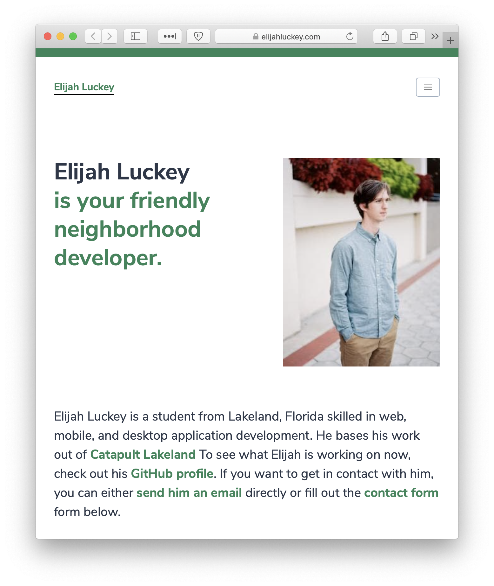

# Elijah Luckey

My personal website.

Hosted by Netlify at [elijahluckey.com](https://elijahluckey.com).

## Make it your own

1. [For this repo](https://github.com/Luckey-Elijah/Personal-Site/fork) and make it your own!
2. Install `gridsome`.
3. Host locally with `gridsome develop`.
4. Host online with [Netlify](https://www.netlify.com).
